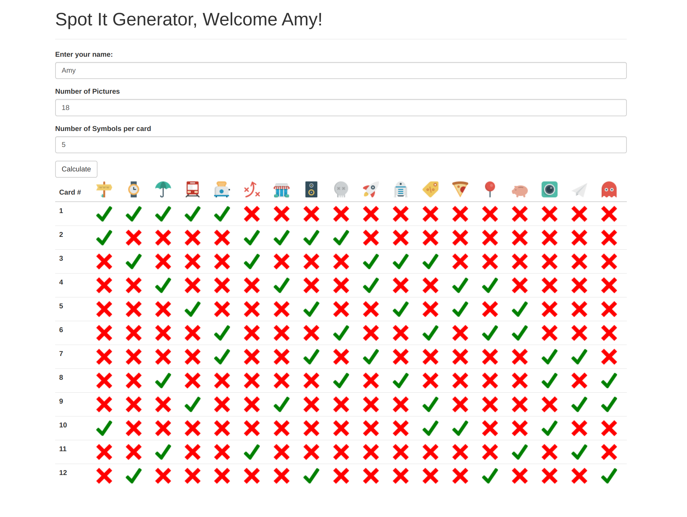

# SpotItFlask
A flask implementation of a basic Spot It style card generator

## Purpose
Implement a naive algorithm for generating all possible cards in a Spot it deck
given the number of pictures in the lexicon and number of pictures per card.

## Dependencies
python3 
pip3

## Usage
Execute the shell script in the root repository by typing ./start.sh into a bash terminal.
The webpage is available on http://127.0.0.1/5000

## Technology
This app uses a Flask backend to serve static webpages along with bootstrap and wtForms for styling
